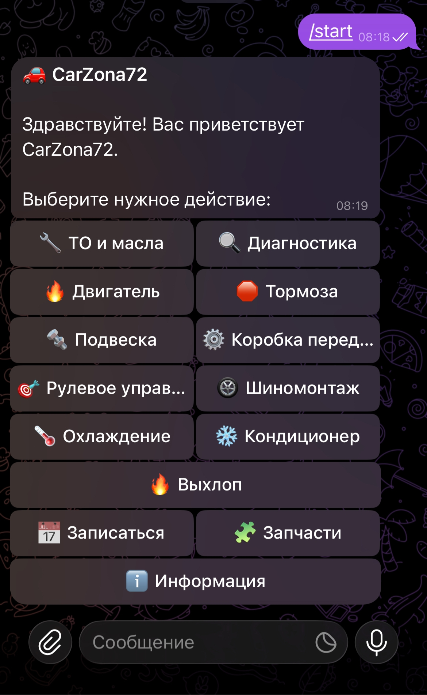
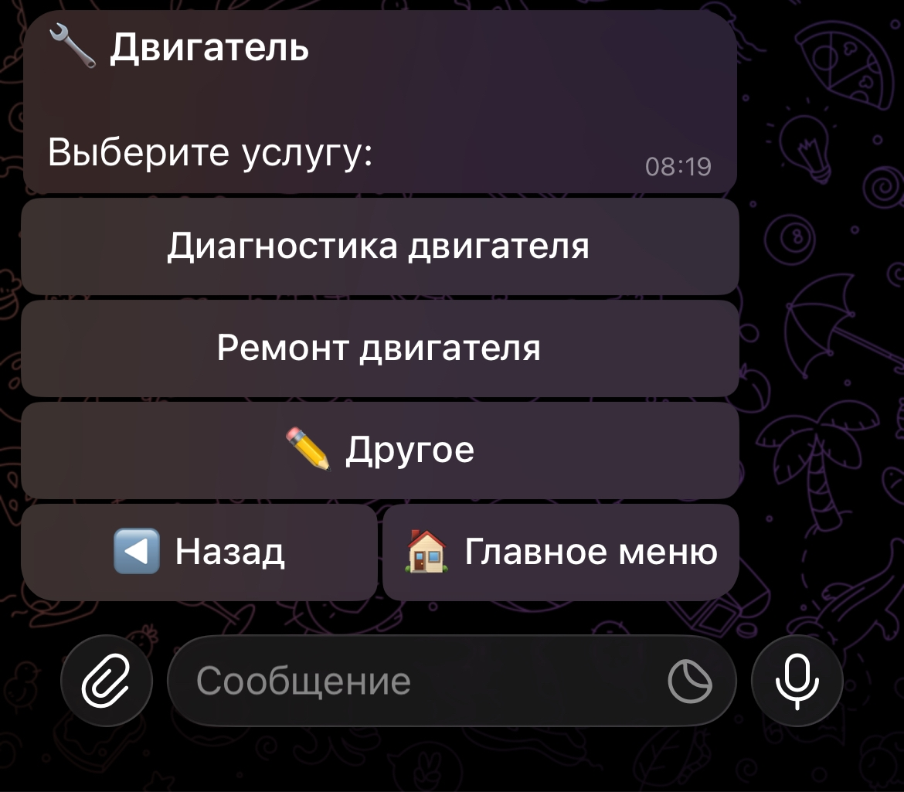
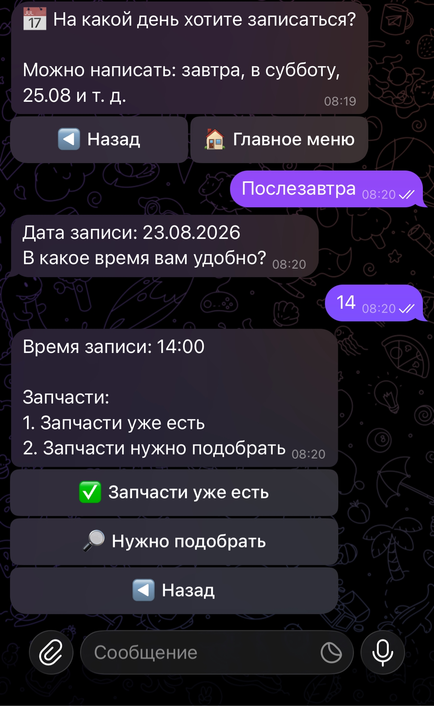
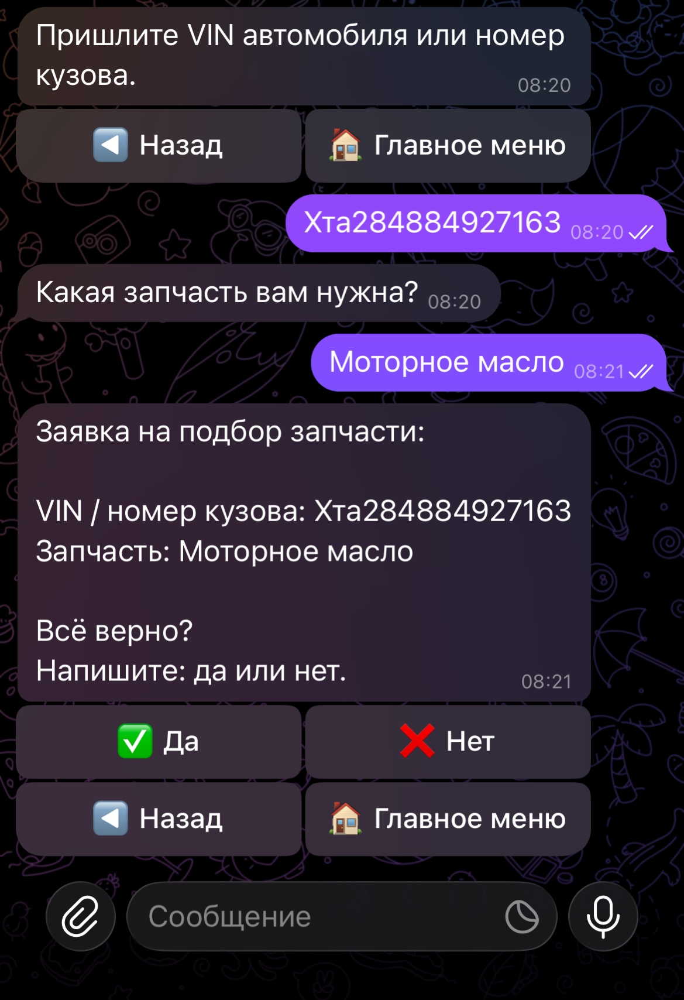
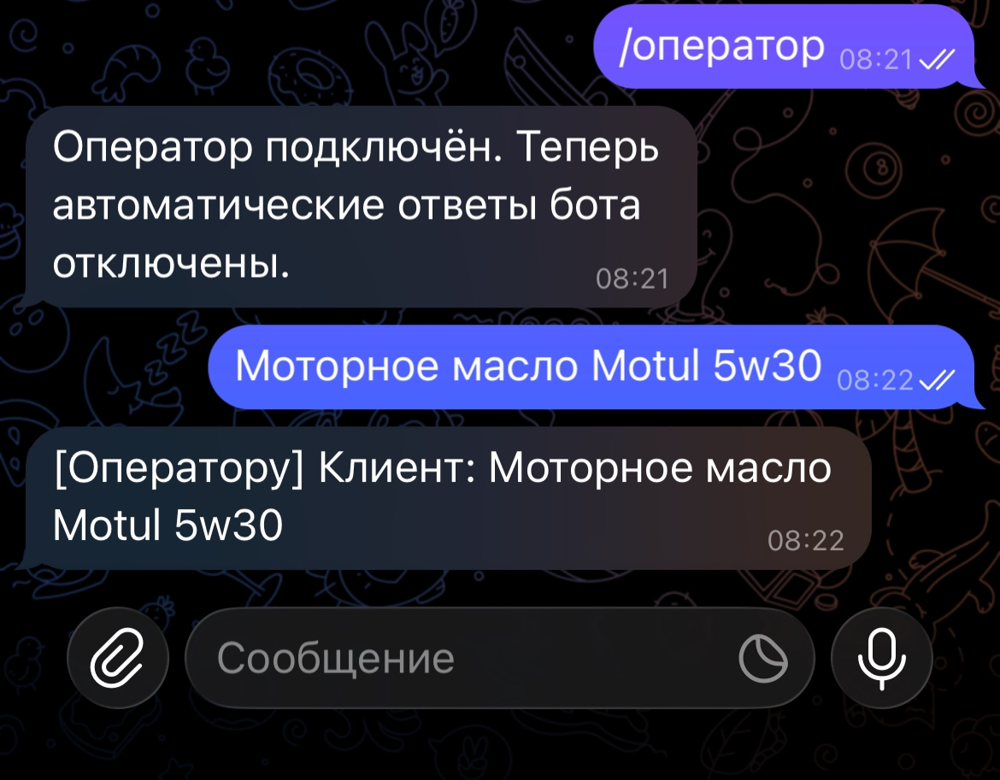

# Кейс задача 3

<h2>Создание чат-бота для автосервиса CarZona72</h2>

В рамках практической кейс-задачи разработан чат-бот для автосервиса <b>CarZona72</b>.

По условию задания необходимо создать простой чат-бот, который распознаёт ключевые слова и предоставляет соответствующие ответы, после чего протестировать и отладить программу и выполнить её развёртывание, например, в Telegram.

Разработка выполнена на языке <b>Python</b> с последующей интеграцией с <b>Telegram</b>.

<h2>Задача</h2>

Необходимо реализовать чат-бота, который сможет:

<ul>
<li>отвечать на типовые вопросы клиента;</li>
<li>предоставлять информацию об автосервисе;</li>
<li>показывать перечень услуг;</li>
<li>проводить пользователя по сценарию записи;</li>
<li>обрабатывать дату и время записи;</li>
<li>работать с подбором запчастей;</li>
<li>при необходимости переключать клиента на оператора.</li>
</ul>

Бот адаптирован под предметную область автосервиса CarZona72.

<h2>Возможности программы</h2>

<h3>Главное меню</h3>

Пользователь может перейти к следующим разделам:

<ul>
<li>ТО и масла;</li>
<li>диагностика;</li>
<li>двигатель;</li>
<li>тормозная система;</li>
<li>подвеска;</li>
<li>коробка передач;</li>
<li>рулевое управление;</li>
<li>шиномонтаж;</li>
<li>охлаждение и радиаторы;</li>
<li>кондиционер;</li>
<li>выхлопная система;</li>
<li>информация об автосервисе;</li>
<li>запись на обслуживание;</li>
<li>подбор запчастей.</li>
</ul>

<h3>Запись на обслуживание</h3>

Бот последовательно запрашивает:

<ol>
<li>услугу;</li>
<li>дату;</li>
<li>время;</li>
<li>наличие запчастей.</li>
</ol>

Для времени реализована проверка рабочего диапазона автосервиса:

<b>10:00–20:00.</b>

Поддерживаются различные форматы ввода времени, например:

<pre>
14
14:30
14-30
14.30
</pre>

<h3>Работа с датами</h3>

Бот умеет обрабатывать несколько вариантов ввода даты:

<pre>
завтра
послезавтра
среда
в среду
25.08
25.08.2026
</pre>

После обработки дата приводится к единому формату.

<h3>Свободное описание услуги</h3>

Если клиент выбирает пункт <b>«Другое»</b>, ему предлагается самостоятельно описать необходимую работу.

После получения текста бот сохраняет описание и предлагает подтвердить необходимость записи.

<h3>Подбор запчастей</h3>

Пользователь может выбрать вариант:

<ul>
<li><b>Запчасти уже есть</b>;</li>
<li><b>Запчасти нужно подобрать</b>.</li>
</ul>

При необходимости подбора бот последовательно запрашивает:

<ol>
<li>VIN или номер кузова;</li>
<li>название требуемой запчасти;</li>
<li>подтверждение заявки.</li>
</ol>

После подтверждения заявка передаётся оператору.

<h3>Режим оператора</h3>

Предусмотрен отдельный режим общения с оператором.

При подключении оператора автоматические ответы бота отключаются. После завершения общения можно вернуть автоматический режим.

<h2>Команды навигации</h2>

<table>
<tr>
<th>Команда</th>
<th>Назначение</th>
</tr>
<tr>
<td>назад</td>
<td>Возврат на предыдущий этап диалога</td>
</tr>
<tr>
<td>начало</td>
<td>Возврат в главное меню</td>
</tr>
<tr>
<td>отмена</td>
<td>Отмена текущего сценария</td>
</tr>
<tr>
<td>выход</td>
<td>Завершение работы</td>
</tr>
</table>

<h2>Telegram-интерфейс</h2>

После тестирования консольной версии бот был интегрирован с Telegram.

В Telegram используются <b>inline-кнопки</b>, благодаря которым пользователь может выбирать категории и действия без ручного ввода номеров.

Текстовый ввод сохраняется для данных, которые удобнее вводить вручную:

<ul>
<li>VIN;</li>
<li>дата;</li>
<li>время;</li>
<li>свободное описание услуги;</li>
<li>название запчасти.</li>
</ul>

<h2>Структура проекта</h2>

<pre>
3Task_ChatBot_CarZona72/
│
├── carzona72_bot_operator.py
├── telegram_bot.py
├── requirements.txt
├── .gitignore
├── README.md
│
└── screenshots/
    ├── 01_main_menu.jpg
    ├── 02_services.jpg
    ├── 03_booking.jpg
    ├── 04_parts.jpg
    └── 05_operator.jpg
</pre>

<h3>Основные файлы</h3>

<b>carzona72_bot_operator.py</b> — основная логика чат-бота и управление состояниями диалога.

<b>telegram_bot.py</b> — Telegram-интерфейс, обработка сообщений и inline-кнопок.

<b>requirements.txt</b> — список необходимых зависимостей Python.

<b>.gitignore</b> — список файлов и каталогов, которые не должны попадать в репозиторий.

<h2>Используемые технологии</h2>

<ul>
<li><b>Python 3</b></li>
<li><b>python-telegram-bot</b></li>
<li><b>Telegram Bot API</b></li>
<li><b>Visual Studio Code</b></li>
<li><b>GitHub</b></li>
</ul>

<h2>Установка</h2>

<h3>1. Установка зависимостей</h3>

<pre>
pip install -r requirements.txt
</pre>

<h3>2. Настройка Telegram-бота</h3>

Для работы требуется токен Telegram-бота, полученный через <b>BotFather</b>.

<b>Важно:</b> настоящий токен не должен публиковаться в открытом GitHub-репозитории.

<h3>3. Запуск</h3>

<pre>
python telegram_bot.py
</pre>

После запуска в терминале отображается сообщение:

<pre>
CarZona72 Telegram Bot запущен...
</pre>

<h2>Принцип работы</h2>

Основная логика бота реализована как последовательность состояний.

<pre>
Главное меню
      ↓
Категория услуг
      ↓
Конкретная услуга
      ↓
Запись
      ↓
Дата
      ↓
Время
      ↓
Запчасти
      ↓
VIN / номер кузова
      ↓
Название запчасти
      ↓
Подтверждение
      ↓
Заявка оператору
</pre>

При ошибочном вводе пользователь получает сообщение с подсказкой и может повторить ввод, не теряя текущее состояние диалога.

<h2>Тестирование</h2>

В ходе разработки было проведено ручное тестирование основных сценариев.

<ul>
<li>проверка главного меню;</li>
<li>проверка всех основных категорий услуг;</li>
<li>проверка пункта «Другое»;</li>
<li>проверка записи на обслуживание;</li>
<li>проверка некорректных значений даты;</li>
<li>проверка некорректных значений времени;</li>
<li>проверка команды «назад» на разных этапах;</li>
<li>проверка подбора запчастей;</li>
<li>проверка VIN и подтверждения заявки;</li>
<li>проверка режима оператора;</li>
<li>проверка Telegram-кнопок.</li>
</ul>

В процессе тестирования были исправлены ошибки обработки состояний, даты и времени, навигации, передачи меню в Telegram и работы callback-кнопок.

<h2>Скриншоты</h2>

<h3>Главное меню</h3>

Рисунок 1: Главное меню Telegram-бота.

<h3>Выбор услуг</h3>

Рисунок 2: Выбор категории и услуги.

<h3>Запись на обслуживание</h3>

Рисунок 3: Сценарий записи на обслуживание.

<h3>Подбор запчастей</h3>

Рисунок 4: Сценарий подбора запчасти.

<h3>Режим оператора</h3>

Рисунок 5: Переключение на оператора.

<h2>Заключение</h2>

В результате выполнена разработка и интеграция чат-бота автосервиса CarZona72.

Созданный прототип поддерживает многошаговый диалог с пользователем, обработку свободного текста, запись на обслуживание, работу с датами и временем, подбор запчастей и операторский режим.

После интеграции с Telegram пользователь может взаимодействовать с ботом через удобный интерфейс с inline-кнопками.

Разработанное решение соответствует требованиям кейс-задачи по созданию чат-бота: реализовано распознавание пользовательских запросов, выдача соответствующих ответов, многошаговое взаимодействие, тестирование и отладка, а также интеграция с Telegram.

